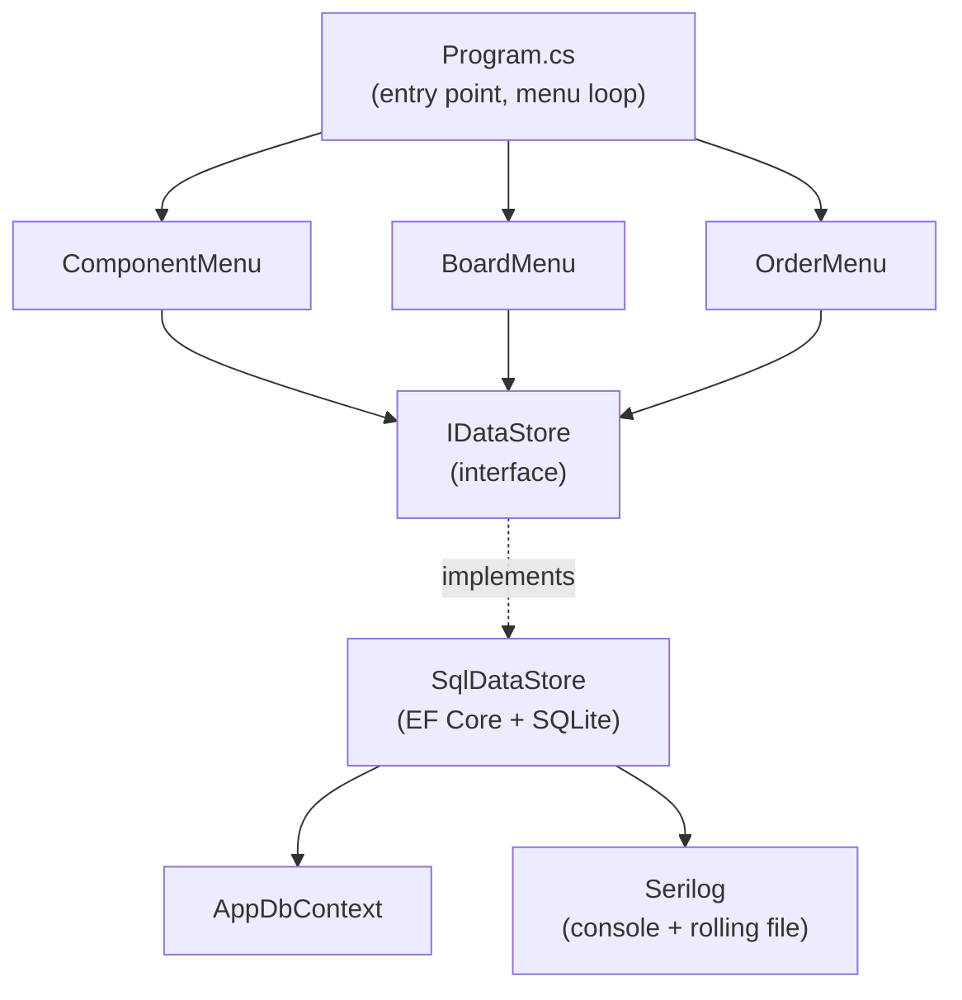

# SMT Order Manager

A platform-independent C# console application for managing Orders, Boards, and Components in an SMT manufacturing environment.

## Contents

- [Quick start](#quick-start)
- [Domain model](#domain-model)
- [Architecture](#architecture)
- [Design decisions](#design-decisions)
- [Testing](#testing)

## Quick start

Requires the [.NET 10 SDK](https://dotnet.microsoft.com/download).

```bash
# restore, build, and run the app
dotnet restore
dotnet build
dotnet run --project SmtOrderManager

# run the test suite
dotnet test
```

On first run, the app creates a SQLite database file (`smtordermanager.db`) next to the executable and applies the schema automatically — no manual migration step is required.

Order downloads (simulated hand-off to a production line) are written as JSON files under a `Downloads/` folder created next to the executable.

## Domain model

Three entities, two many-to-many relationships:

- An **Order** includes one or more **Boards**; a **Board** can appear in multiple **Orders**.
- A **Board** contains one or more **Components**; a **Component** can be placed on multiple **Boards**.

```mermaid
erDiagram
    ORDER {
        int Id
        string Name
        string Description
        datetime OrderDate
    }
    BOARD {
        int Id
        string Name
        string Description
        double Length
        double Width
    }
    COMPONENT {
        int Id
        string Name
        string Description
        int Quantity
    }

    ORDER }--{ BOARD : "OrderBoards"
    BOARD }--{ COMPONENT : "BoardComponents"
```

The two join tables (`OrderBoards`, `BoardComponents`) are managed automatically by EF Core's many-to-many mapping — there are no explicit join-entity classes in the codebase.

## Architecture



**Layers:**

- **Models** (`Models.cs`) — plain POCOs for `Order`, `Board`, `Component`, with navigation collections for the many-to-many relationships.
- **Persistence** (`AppDbContext`, `SqlDataStore`) — EF Core over SQLite. `SqlDataStore` implements `IDataStore` and owns all CRUD, search, relationship management, and JSON export logic.
- **Abstraction** (`IDataStore`) — the seam between UI and persistence. Menus depend only on this interface, not on `SqlDataStore` directly, so the storage technology could be swapped (e.g., for a different database or an in-memory store in tests) without touching the UI layer.
- **UI** (`ComponentMenu`, `BoardMenu`, `OrderMenu`, `ConsoleHelper`) — console-based CRUD menus per entity, with shared input-parsing/validation helpers in `ConsoleHelper` to avoid duplicating prompt/parse/retry logic.
- **Cross-cutting** — Serilog writes to both console and a daily rolling log file, capturing create/update/delete/download actions.

## Design decisions

- **SQLite + EF Core** was chosen over MS SQL or flat-file storage for zero-setup portability: no external database server is required, and the schema is created automatically on first launch, which matches the "platform-independent" requirement.
- **Repository-style abstraction (`IDataStore`)** keeps the console UI decoupled from EF Core, supporting the Dependency Inversion Principle and making the data layer independently testable and swappable.
- **JSON export via `DownloadOrder`** simulates handing an order off to a production line. The manifest nests each Board's Components directly under that Board, matching the natural Order → Board → Component hierarchy a production line would consume.
- **Many-to-many via EF Core conventions** (`UsingEntity` with explicit table names) avoids hand-written join-entity classes, keeping the model layer minimal per DRY.

## Testing

`SmtOrderManager.Tests` covers, against a temporary on-disk SQLite database per test run:

- Component CRUD and search
- Board↔Component and Order↔Board relationship assignment/removal
- The JSON download flow end-to-end

Run with:

```bash
dotnet test
```